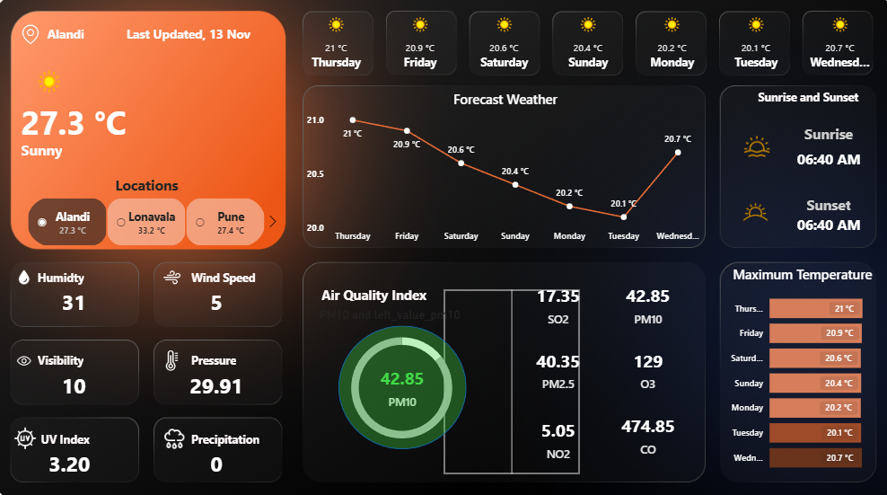

# 🌤️ Weather & Air Quality Dashboard (Power BI)

## 📘 Overview
This Power BI Dashboard provides a **real-time weather and air quality monitoring** experience.  
It displays key environmental parameters such as **temperature, humidity, wind speed, air pollutants, and forecast trends** for multiple locations.

The dashboard integrates weather and air-quality data to give users an intuitive understanding of current conditions and future forecasts.

---

## 🖼️ Dashboard Preview


---

## 🚀 Features
- 🌍 **Multi-location Support** — View weather details for cities like *Alandi*, *Lonavala*, and *Pune*.  
- 🌡️ **Real-time Weather Data** — Displays temperature, humidity, visibility, UV index, and pressure.  
- 🌬️ **Air Quality Index (AQI)** — Includes PM10, PM2.5, SO2, NO2, CO, and O3 levels.  
- 📊 **Forecast Visualization** — Line chart showing upcoming temperature trends.  
- 🌅 **Sunrise & Sunset Information** — Daily sun timings.  
- 🌈 **Dynamic AQI Coloring & Status Text** —  
  AQI levels are color-coded and labeled using DAX measures:
  - Good (Green)  
  - Moderate (Yellow)  
  - Unhealthy for Sensitive (Orange)  
  - Unhealthy (Red)  
  - Very Unhealthy (Purple)  
  - Hazardous (Dark Maroon)

---

## 🧮 DAX Measures Used

### 🎨 AQI Color Measure
```DAX
AQI Color = 
VAR AQI = ROUND(SELECTEDVALUE('Current'[current.air_quality.pm10]), 0)
RETURN
SWITCH(
    TRUE(),
    AQI <= 50,  "#43d946",   -- Good
    AQI <= 100, "#fff570",   -- Moderate
    AQI <= 150, "#ff9800",   -- Poor
    AQI <= 200, "#d99343",   -- Unhealthy
    AQI <= 300, "#ff5bdf",   -- Severe
    "#d95243"                -- Hazardous
)

AQI_Status_Text =
VAR AQI = ROUND(SELECTEDVALUE('Current'[current.air_quality.pm10]), 0)
RETURN
SWITCH(
    TRUE(),
    AQI <= 50,  "Good",
    AQI <= 100, "Moderate",
    AQI <= 150, "Unhealthy for Sensitive",
    AQI <= 200, "Unhealthy",
    AQI <= 300, "Very Unhealthy",
    "Hazardous"
)

---
```

## 🛠️ Tools & Technologies

Power BI Desktop

DAX (Data Analysis Expressions)

Weather & Air Quality Data APIs

Custom Visualization & Data Modeling

---

## 📂 Folder Structure

📁 Weather-dashboard
 ┣ 📂 Backgrounds
 ┣ 📂 Dataset (optional)
 ┣ 📂 Icons
 ┣ 📊 file.pbix
 ┣ 🖼️ dashboard.png
 ┗ 📄 README.md

 ---

## 🌐 Dataset Source

You can easily connect Power BI to real-time weather data using any free Weather API:

Go to a Weather API website such as:

https://openweathermap.org/api

https://www.weatherapi.com/

Copy your API request URL (for example, current weather or air quality endpoint).

In Power BI Desktop, go to:

Home → Get Data → Web

Paste the copied API link and load the data directly.

Refresh the dashboard to view live updates.

💡 Tip: You can store your CSV or API-based dataset in the Dataset (optional) folder if you prefer using static data.

---

## ⭐ How to Use

Download or clone this repository.

Open file.pbix in Power BI Desktop.

Follow the dataset connection steps above.

Refresh the report to view the latest data.

---


 

